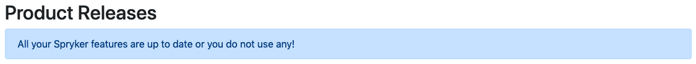
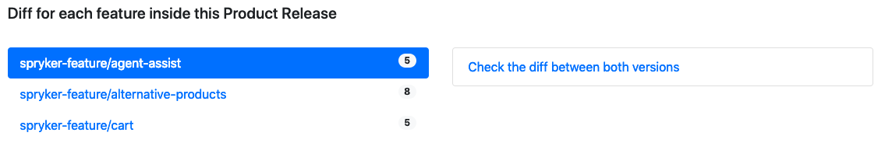
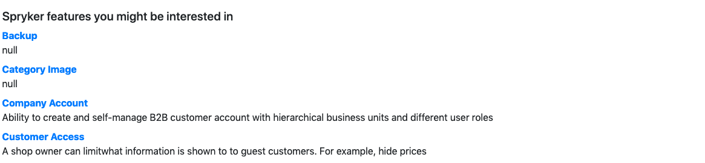
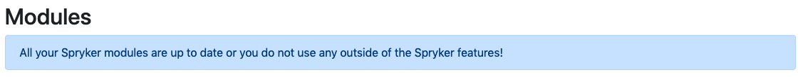
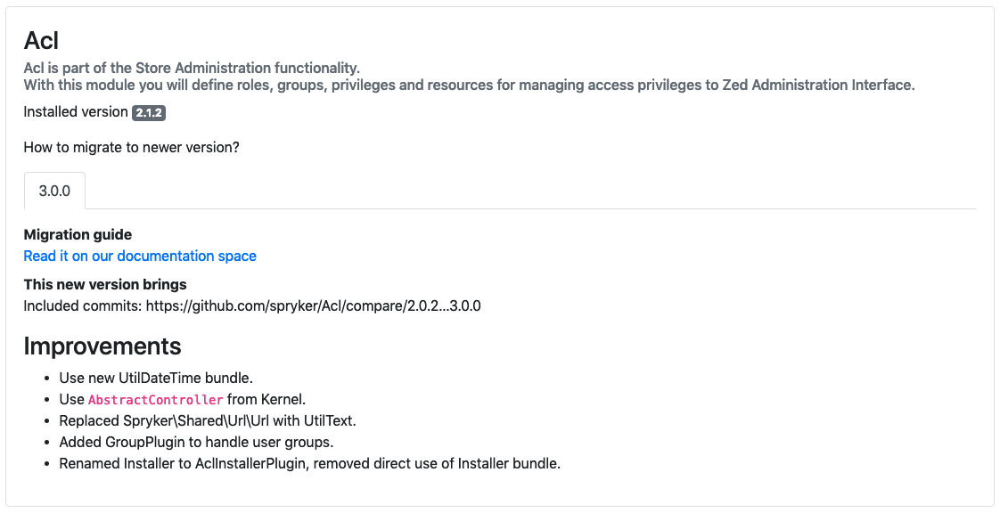

# Spryker Migration Analyzer

Alpha version - Spryker internal!

## Installation & Usage

1. Fork/Clone/Download this repo
2. Copy/Paste your `composer.json` inside the property `myComposerJSON` of the file `my-composer-files/composerJSON.js`
3. Copy/Paste your `composer.lock` inside the property `myComposerLOCK` of the file `my-composer-files/composerLOCK.js`
4. Uncomment the lines __61__ and __64__ inside `index.html` and save
5. Open `index.html` inside your browser and enjoy your migration analysis

## What are you seing?

### Product Release migrations

If your Spryker project is using our `spryker-feature` repositories you can see 2 states:

* You are up to date! (or you do not use `spryker-feature`)
* You see that migration is needed to move your project to the next Spryker Product Release

#### Everything is up to date

Currently the Migration Analyzer does not make the difference if you use Spryker features or not.

#### You need to migrate to a more recent Product Release

You will see 3 parts for each Product Releases:

1. Migration guides for each module that upgraded to a new major

2. For each `spryker-feature` you will see a link to compare the diff between your version and the new version

3. The list of features that you project currently not use and that might interest you

Each Spryker feature is a link that redirect you to the Github repository.

### Module migrations

Here you will see only modules that your project use that are not part of a `spryker-feature`. You can see 2 states:

* You are up to date!
* You see that migration is needed to move each module to the next major version

#### Everything is up to date

#### You need to migrate your module to use the next major version

For each module, you will see the following.

## Resources

Links to retrieve data from Release app:

* [Modules](https://release.spryker.com/modules.json?contain=ModuleVersions)
* [Features](https://release.spryker.com/features.json?contain=FeatureVersions)

Links for migration guides in Spryker documentation

* https://documentation.spryker.com/module_migration_guides/mg-product.htm
